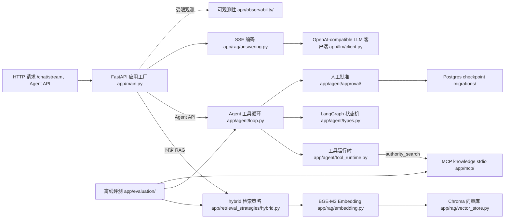

# med-agent

从零目录重建的医疗知识检索与受控 Agent 学习工程。项目目标是用一份可审计、可复现的本地代码库学习检索增强生成（RAG）、Agent 工具循环、Model Context Protocol（MCP）服务与离线评测的工程化方法，并产出可经追问的求职证据。本项目**不提供**任何医学诊断结论、个体健康建议或生产可用性声明。

## 1. 项目定位与医学信息边界

- 工程边界：检索语料均为通用医学常识文本（如高血压日常管理、运动与饮食），不接入真实病例与个体身份信息，不输出特定医学指令。
- 能力声明边界：本项目自称的是"工程能力"而非"医学正确性"。任何架构或指标数字均不做临床效果或诊断能力宣称。
- 部署边界：本地学习用途，未对外部署；未做安全鉴权。受限真实 Provider Agent 评测仅在项目所有者批准和调用上限内执行，结果保留脱敏报告；M5 离线评测仍为合成工程证据（synthetic-only）。
- 失败优先：所有受控能力默认安全失败。MCP authority_search 在生产失败时 fail-closed，缓存默认旁路，hybrid 为聊天唯一允许的检索策略（dense 仍作离线对照）。

## 2. 架构

下图描述组件之间的实际数据关系；每条组件均可回链到源码或测试。箭头表示真实调用方向。



可回链证据（公开候选导出范围内的源码与测试）：

- FastAPI 应用与 SSE 路由：[app/main.py](app/main.py)；公开候选提供最小契约测试：[tests/contract/test_public_contract.py](tests/contract/test_public_contract.py)
- hybrid 检索（dense+BM25 RRF）与 Chroma 持久化：[app/retrieval_strategies/hybrid.py](app/retrieval_strategies/hybrid.py)、[app/retrieval_strategies/dense.py](app/retrieval_strategies/dense.py)、[app/rag/vector_store.py](app/rag/vector_store.py)；测试位于 tests/test_retrieval_store.py、tests/test_vector_store.py（公开候选是否随 tests/ 导出由 allowlist 决定）
- Embedding：[app/rag/embedding.py](app/rag/embedding.py)；测试位于 tests/test_embedding.py（公开候选是否随 tests/ 导出由 allowlist 决定）
- Agent 工具循环与状态：[app/agent/loop.py](app/agent/loop.py)、[app/agent/types.py](app/agent/types.py)
- 人工批准与 checkpoint：[app/agent/approval/](app/agent/approval)、migrations/（agent_runs、agent_approvals SQL 迁移；公开候选是否纳入由 allowlist 决定）
- MCP knowledge server：[app/mcp/](app/mcp)
- 可观测性：[app/observability/](app/observability)
- 离线评测：[app/evaluation/](app/evaluation)

## 3. 本地启动、配置、测试与最小演示

所有命令均为本地命令，不触达任何外部部署或真实上游 provider。

**工作目录硬前置**：下列命令必须在包含 `docker-compose.yml`、`app/`、`scripts/` 的 `med-agent` 项目根执行。若当前目录不是项目根，会出现：

- `docker compose`: `no configuration file provided: not found`
- `uvicorn app.main:app`: `ModuleNotFoundError: No module named 'app'`
- `python scripts/...`: `can't open file '...\scripts\....py'`

这些不是服务本身损坏，先进入项目根再继续。

```powershell
# 0) 先在终端进入 clone 后的 med-agent 项目根；务必先做这一步
Test-Path .\docker-compose.yml   # 必须为 True
Test-Path .\app\main.py          # 必须为 True

# 1) 使用项目虚拟环境（本仓库演示环境名为 .venv-m1-2；也可自建 .venv）
$py = ".\.venv-m1-2\Scripts\python.exe"
# 若没有现成 venv：
# py -3.12 -m venv .venv
# $py = ".\.venv\Scripts\python.exe"
# & $py -m pip install -r requirements.txt
# & $py -m pip install -r requirements-dev.txt

# 2) 配置本机密钥（.env 不入库、不进入公开候选）
# 私有副本可参考 `.env.example`；公开候选不导出该模板。

# 3) 启动依赖与本机 API（SSE smoke 用本机 uvicorn + 本机 Chroma，不要依赖 Docker api）
docker compose up -d postgres redis
& $py -m uvicorn app.main:app --host 127.0.0.1 --port 8000

# 4) 另开一个已位于项目根的终端做健康检查
curl http://127.0.0.1:8000/health

# 5) 最小真实 SSE 演示（脱敏输出，不含完整回答）
& $py scripts\prepare_streaming_smoke_data.py
& $py scripts\smoke_streaming_answer.py

# 6) 可选：MCP smoke（record 放仓库外；PowerShell 不要粘贴尖括号占位符）
# $record = Join-Path $env:TEMP ("med-agent-mcp-record-" + [guid]::NewGuid().ToString("N") + ".json")
# & $py scripts\run_mcp_client_smoke.py --record $record

# 7) 公开 clone 的离线契约测试（不读 .env，不触发网络）
& $py -m pytest tests/contract -q
```

执行说明：

- 先进入项目根；不要在其他目录直接复制执行 compose/uvicorn/scripts。
- API 在首次 /chat/stream 或 Agent 请求前不会读取密钥或加载模型，避免任何启动期网络行为。
- 真实 LLM 调用依赖 .env 中的 LLM_API_KEY；缺密钥会在网络访问前以 503 失败，绝不打印或回显密钥。
- 测试默认使用 falsified 检索与 LLM，可在不联网、无真实密钥状态下完整运行。
- 公开候选只导出 `tests/contract/`；它验证 fixture、评测 schema 与基础切片，不替代私有副本中的完整测试与正式评测。
- PowerShell 中 `--record` 后必须是真实路径字符串，不能原样粘贴 `<仓库外路径>`。

## 4. 能力矩阵与失败边界

| 能力 | 实现位置 | 失败/边界 |
| --- | --- | --- |
| 固定 RAG（hybrid） | [app/retrieval_strategies/hybrid.py](app/retrieval_strategies/hybrid.py) | 聊天唯一允许的检索策略；RETRIEVAL_METHOD != hybrid 会在 SettingsError 拒绝 |
| SSE 流式问答 | [app/rag/answering.py](app/rag/answering.py) | 未命中候选时不伪造 sources；上游缺失返回 error 帧 |
| Agent 工具循环 | [app/agent/loop.py](app/agent/loop.py) | 工具异常 fail-closed，run 失败为可恢复状态而非伪成功 |
| LangGraph 状态机 | [app/agent/types.py](app/agent/types.py) | 状态边界由不可变 dataclass 强制 |
| 人工批准 / checkpoint | [app/agent/approval/](app/agent/approval) | 高风险动作暂停等用户批准；Postgres 持久化用 CAS 版本号 |
| MCP knowledge search | [app/mcp/](app/mcp) | authority_search 在生产环境前 fail-closed，不接入真实权威源 |
| 脱敏可观测性 | [app/observability/](app/observability) | query / 回答正文 / 健康 / 密钥永不进入事件或指标 |
| 缓存策略 | [app/evaluation/cache/](app/evaluation/cache) | default_bypass = true；不以 synthetic 证据声明热路径就绪 |
| 负载压测 | [app/evaluation/load/](app/evaluation/load) | 工具以 fake-fixed-delay 受控运行，不做生产容量外推 |
| 质量评测 | [app/evaluation/quality/](app/evaluation/quality) | synthetic-only，owner gate pending，不作质量 pass 声明 |
| 成本统计 | [app/evaluation/cost/](app/evaluation/cost) | known_cost_sum 仅合成价格基准；summary_amount 未公开 |
| 公开候选导出 | app/public_export/ | allowlist 显式包含；二进制默认拒绝；扫描命中即 fail-closed |

M7 后聊天默认 hybrid；dense / dense-rerank / rewrite-dense 仍保留为显式离线评测接口。历史 v1 决策见 evaluation/decisions/m2-retrieval-decision-v2.json；v2 实测见 evaluation/reports/hybrid-v2-review-candidate-fixed-f5c186148512-fdc09986-20260812T052633Z/。

## 5. 指标表

下表每个数值均保留其合成/未公开语义，不外推为生产指标。证据路径 列指向私有仓库的真实报告；这些报告**不进入公开候选**，故不可作为公开链接。"可否用于简历"以"否"或"候选"标注；只有用户亲手复现并测量确认的数字可升级为正式简历指标。

| 指标 | 数值 | 测量条件 | 证据路径（私有） | 可否用于简历 |
| --- | --- | --- | --- | --- |
| dense citation_coverage | synthetic-only（未公开） | M5.1 synthetic 2-track 评测 | evaluation/reports/m5-quality-v1-synthetic-demo/summary.md | 否 |
| dense factuality_pass_rate | synthetic-only（未公开） | 同上 | 同上 | 否 |
| dense-chat c=1 p50 延迟 | synthetic-only（未公开） | M5.2 synthetic 本机 fake 负载 | evaluation/reports/m5-load-v1-synthetic-demo/summary.md | 否 |
| dense-chat c=2 成功率 | synthetic-only（未公开） | 同上 | 同上 | 否 |
| 可观测性 request_total | synthetic-only（未公开） | M5.3 synthetic 5 事件 | evaluation/reports/m5-observability-v1-synthetic-review-fix-r5/summary.md | 否 |
| 可观测性 contract_violation_count | synthetic-only（未公开） | 同上 | 同上 | 否 |
| 缓存 hit_rate | synthetic-only（未公开） | M5.4 synthetic 14 事件 | evaluation/reports/m5-cache-v1-synthetic-demo/summary.md | 否 |
| 缓存 default_bypass | True（运行时默认） | M5.4 冻结 manifest | 同上 | 候选（设计合规项，非性能数字） |
| 成本 known_cost_sum | synthetic-only（未公开） | M5.5 synthetic 价格表 | evaluation/reports/m5-cost-v1-synthetic-demo/summary.md | 否 |
| M5 总体生产接入 | synthetic-only，owner gate pending | M5.6 五线汇总 | evaluation/reports/m5-closure-v1-synthetic-demo/summary.md | 否 |
| M7 决策 selected_method | hybrid（v2 fixed 实测） | 164 case；Recall@5 0.9486 / MRR@10 0.8392 | evaluation/reports/hybrid-v2-review-candidate-fixed-f5c186148512-fdc09986-20260812T052633Z/ | 是（检索质量） |
| M2 rewrite-dense 额外 P50 | synthetic-only（未公开） | 在线测量，环境不统一 | 同上 | 否 |

不在表中的维度统一视为"未公开/未核验"。任何把上述数值改写为生产级性能、质量、缓存或成本主张的写法均与本项目证据边界冲突。

## 6. 项目结构、隐私与安全说明、复现限制与许可证

### 6.1 项目结构（公开候选导出范围）

本节描述公开候选导出的实际目录布局；data/ 原始语料、observability/ 与 evaluation/reports 的原始数据与报告、.codestable/、.m6-public-candidate/、.venv*、私密任务书与开发日志均不进入公开候选。

```text
med-agent/
├── app/                      # 应用源码：API、rag、agent、retrieval_strategies、mcp、observability、evaluation、settings、llm
├── fixtures/public/          # 非敏感文本 fixture 与评测 schema
├── tests/contract/           # 可离线运行的最小公开契约测试
├── docs/PUBLIC_REPRODUCIBILITY.md
├── requirements.txt          # 运行时依赖固定版本
├── requirements-dev.txt      # 开发与测试依赖
├── Dockerfile                # 本地容器构建
├── docker-compose.yml        # 本地多服务编排
├── .dockerignore             # 容器构建排除
└── .gitignore                # Git 本地派生排除
```

### 6.2 隐私与安全说明

- .env 永不入库、不进入公开候选；真实 API 密钥只在本机内存中使用，绝不打印或进入异常消息。
- 工程扫描规则（私有仓库 app/public_export/config/public-export-scan-rules-v1.json）覆盖密钥、邮箱、手机号、用户指定学校标识、本地盘符路径、真实医疗问答样本；命中即 fail-closed，不回显命中正文。
- query、回答正文、健康信息、个体身份标识、密钥、provider 原始响应不进入事件、指标、cache value、observability 或公开候选。

### 6.3 复现限制

- M5 全部报告为 synthetic-only，owner gate pending；不可作为生产指标复现。
- 真实 provider 调用只在项目所有者明确授权、调用上限和脱敏审计下执行；online rewrite 测量结果存在环境指纹不统一，不参与速度排序。
- dense-rerank、rewrite-dense 仍保留为离线评测；hybrid 已接入生产聊天默认。如需复现，须使用 v2 fixed manifest/confirmation 与对应 reports。
- 公开 clone 可按 [PUBLIC_REPRODUCIBILITY.md](docs/PUBLIC_REPRODUCIBILITY.md) 运行最小 fixture 与 contract tests；它不是完整数据和正式指标的替代品。

### 6.4 许可与依赖声明

- 项目源码许可证为根目录 [MIT License](LICENSE)；它不覆盖 MedlinePlus 原始资料，公开候选导出前仍需逐条完成脱敏与来源条款复核。
- 第三方依赖许可证按 [requirements.txt](requirements.txt) 与 [requirements-dev.txt](requirements-dev.txt) 逐项复核；关键直接依赖包括 FastAPI、Uvicorn、sentence-transformers、ChromaDB、httpx、python-dotenv、LangGraph、psycopg、mcp、sse-starlette。
- 本 README 不嵌入追踪像素、徽章或外部未核验链接；架构图使用仓库内可审计的 Mermaid 源码。
